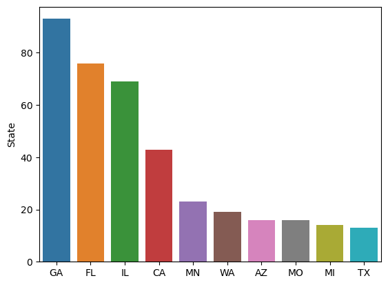

# Failed Bank Data Analysis

For this project we will be analyzing the FDIC failed bank list. The source of this list is the FDIC website. The list includes bank failures since October 1, 2000.

### Background

In the context of this project, a failed bank, according to the FDIC, is an FDIC insured bank that is unable to meet its obligations to depositors and others.

### Analysis

```python
import numpy as np
import pandas as pd
import matplotlib.pyplot as plt
import seaborn as sns
```


```python
data = pd.read_csv('from_sheets_failed_banklist_data.csv')
```


```python
data.head()
```


<div>
<style scoped>
    .dataframe tbody tr th:only-of-type {
        vertical-align: middle;
    }

    .dataframe tbody tr th {
        vertical-align: top;
    }

    .dataframe thead th {
        text-align: right;
    }
</style>
<table border="1" class="dataframe">
  <thead>
    <tr style="text-align: right;">
      <th></th>
      <th>Bank Name</th>
      <th>City</th>
      <th>State</th>
      <th>Cert</th>
      <th>Acquiring Institution</th>
      <th>Closing Date</th>
      <th>Fund</th>
    </tr>
  </thead>
  <tbody>
    <tr>
      <th>0</th>
      <td>Citizens Bank</td>
      <td>Sac City</td>
      <td>IA</td>
      <td>8758</td>
      <td>Iowa Trust &amp; Savings Bank</td>
      <td>3-Nov-23</td>
      <td>10545</td>
    </tr>
    <tr>
      <th>1</th>
      <td>Heartland Tri-State Bank</td>
      <td>Elkhart</td>
      <td>KS</td>
      <td>25851</td>
      <td>Dream First Bank, N.A.</td>
      <td>28-Jul-23</td>
      <td>10544</td>
    </tr>
    <tr>
      <th>2</th>
      <td>First Republic Bank</td>
      <td>San Francisco</td>
      <td>CA</td>
      <td>59017</td>
      <td>JPMorgan Chase Bank, N.A.</td>
      <td>1-May-23</td>
      <td>10543</td>
    </tr>
    <tr>
      <th>3</th>
      <td>Signature Bank</td>
      <td>New York</td>
      <td>NY</td>
      <td>57053</td>
      <td>Flagstar Bank, N.A.</td>
      <td>12-Mar-23</td>
      <td>10540</td>
    </tr>
    <tr>
      <th>4</th>
      <td>Silicon Valley Bank</td>
      <td>Santa Clara</td>
      <td>CA</td>
      <td>24735</td>
      <td>First–Citizens Bank &amp; Trust Company</td>
      <td>10-Mar-23</td>
      <td>10539</td>
    </tr>
  </tbody>
</table>
</div>


```python
data.columns = ['Bank Name', 'City', 'State', 'Cert', 'Acquiring Institution',
       'Closing Date', 'Fund']
```


```python
data.State.head()
```


    0    IA
    1    KS
    2    CA
    3    NY
    4    CA
    Name: State, dtype: object


What states has the most failed banks?


```python
data.State.value_counts().head(10)
```


    GA    93
    FL    76
    IL    69
    CA    43
    MN    23
    WA    19
    AZ    16
    MO    16
    MI    14
    TX    13
    Name: State, dtype: int64


```python
data.State.nunique()
```


    44


From this dataset, we see a disparity in the number of failed banks for each state. The above output are the top 10 states with the most bank failures since 2000. We can plot these numbers to get a feel for the differences in magnitude.


```python
sns.barplot(x = data.State.value_counts().head(10).index,y = data.State.value_counts().head(10) )
```


    <AxesSubplot:ylabel='State'>


    

    


```python
state_counts = data.State.value_counts() 
```


```python
state_counts.value_counts() #given a number, counting how many states have that as their bank closure count.
```


    1     5
    2     4
    3     4
    4     4
    7     4
    10    4
    16    2
    6     2
    12    2
    8     2
    9     1
    5     1
    93    1
    76    1
    13    1
    14    1
    19    1
    23    1
    43    1
    69    1
    11    1
    Name: State, dtype: int64


```python
state_counts[(state_counts <= 13) & (state_counts.index != 'TX')].shape[0]
```


    34


```python
34/44
```


    0.7727272727272727


We have $34/44 = 77$ percent of states have less than 13 banks fail since October 1, 2000.

### Conclusion

Looking at the data, we can see disparities in the numbers of failed banks per state. The next step is to understand why these disparities exist. 
